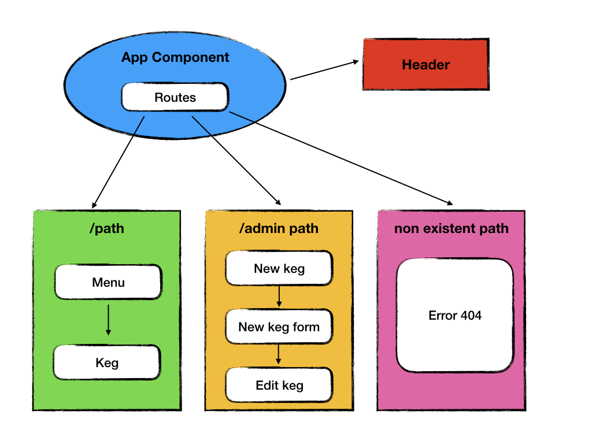

# tap-room-react

#### React app for a bar to track kegs. 06/29/2018

#### By **Justin Roller**

## Description

This is React app for a bar  to track their kegs.

## Component-Structure

## Current features:

* There is a list/menu of all available kegs. Each keg has its name, brewer, price and alcoholContent.

* On the page you can see how many pints are left in a keg. (A full keg has roughly 124 pints).

* There is a form where a new keg can be added to the list.

## Future features:

* As an employee, I want the option to edit a keg's properties after entering them just in case I make a mistake.

* As an employee, I want to be able to click a button next to a keg whenever I sell a pint of it. This should decrease the number of pints left by 1.

* As an employee, I want to be able to see kegs with less than 10 pints left so I can be ready to change them.

* As a patron, I want to have kegs prices to be color-coded for easy readability.

* As a patron, I want to use the alcohol content property to display stronger beers differently than weaker beers.

## Setup/Installation Requirements

1. Clone this repository from GitHub.

2. Run npm install to install all dependencies.

3. Run npm run start and navigate to http://localhost:8080/. The app will automatically reload if you change any of the source files.

## Technologies Used
* HTML
* CSS
* React
* Javascript
* JSX
* REACT

## Support and contact details

Please feel free to contact at justinrllr@yahoo.com with any suggestions or feedback.

### License

*This software is licensed under the MIT license.*

Copyright (c) 2018 **_Justin Roller_**
